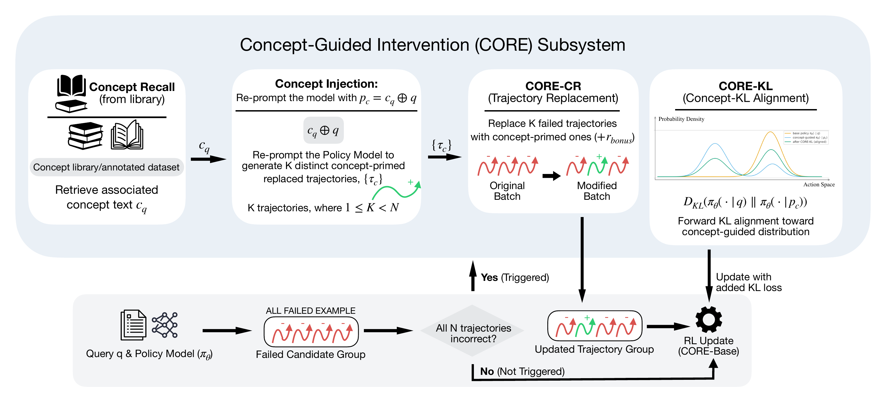
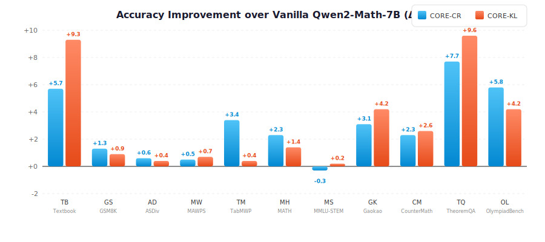

<div align="center">

# CORE

### Concept-Oriented Reinforcement for Bridging the Definition–Application Gap in Mathematical Reasoning

[](https://arxiv.org/abs/2512.18857)
[](https://iclr.cc/virtual/2026/poster/10007328)
[](LICENSE)

**Zijun Gao<sup>1</sup> &nbsp; Zhikun Xu<sup>2</sup> &nbsp; Xiao Ye<sup>2</sup> &nbsp; Ben Zhou<sup>2</sup>**

<sup>1</sup>University of Illinois Urbana–Champaign &nbsp;&nbsp; <sup>2</sup>Arizona State University

</div>

This is the official implementation of [CORE: Concept-Oriented Reinforcement for Bridging the Definition–Application Gap in Mathematical Reasoning](https://arxiv.org/abs/2512.18857) (ICLR 2026). LLMs often solve challenging math exercises yet fail to apply concepts correctly when genuine understanding is required. CORE bridges this *definition–application gap* by turning explicit textbook concepts into RL training signals — through concept-aligned quizzes, concept-injected rollouts, and concept-aware optimization (GRPO). Across four model families, CORE delivers consistent gains on 11 math benchmarks, with improvements of up to **+9.3%** on in-domain and **+9.6%** on out-of-domain tasks.

<p align="center"></p>
<p align="center"><sub>Overview of the CORE framework. When all solutions fail, CORE retrieves relevant concepts, re-prompts the model, and applies either <b>trajectory replacement</b> (CORE-CR) or <b>KL alignment</b> (CORE-KL).</sub></p>

## How to Run

We provide preprocessed RL and SFT datasets in the following directories:

- Reinforcement Learning (RL) data: `data/` (parquet files + concept quizzes)
- Supervised Fine-Tuning (SFT) data: `fine-tune/` (LLaMA-Factory format, generated via `convert_data.py`)

### Environment Setup

We use three separate conda environments due to dependency conflicts (e.g., different vLLM versions).

- **`core_train`** — RL training (verl + vLLM 0.6.3)

```bash
git clone https://github.com/ARC-ASU/CORE.git && cd CORE
conda create -n core_train python=3.10 -y && conda activate core_train
pip install torch==2.4.0 torchaudio==2.4.0 torchvision==0.19.0 --index-url https://download.pytorch.org/whl/cu121
pip install -r requirements/requirements_rl.txt
pip install flash-attn==2.8.3 --no-build-isolation  # after torch: PyPI ships source only, needs torch at build time
pip install -e .  # verl
```

- **`core_sft`** — Supervised fine-tuning (LLaMA-Factory)

```bash
conda create -n core_sft python=3.11 -y && conda activate core_sft
pip install -r requirements/requirements_sft.txt
cd fine-tune/LLaMA-Factory && pip install -e . --no-deps
```

- **`core_eval`** — Evaluation (vLLM 0.5.1)

```bash
conda create -n core_eval python=3.10 -y && conda activate core_eval
pip install torch==2.3.0 torchvision==0.18.0 --index-url https://download.pytorch.org/whl/cu121
pip install -r requirements/requirements_eval.txt
```

> **Hardware**: 2–4x H200 GPUs (140 GB). CUDA 12.1+.

### RL Training

```bash
# main script
bash scripts/train/run.sh core_cr    # Main result (Table 2)
# checkpoints are saved to outputs/<config>/<project>/<experiment-timestamp>/global_step_N/actor
# (core_cr trains 51 steps; the reported checkpoint is global_step_50) and already
# contain ready-to-evaluate HuggingFace weights (config + *.safetensors).
# Optional: rebuild the HF weights from the FSDP shards into actor/huggingface/ with
python scripts/model_merger.py --local_dir "$(ls -d outputs/core_cr/*/*/global_step_50/actor | tail -1)"
```

Available configs (`scripts/train/configs/`):

| Config | Method | Model | GPUs | Paper |
|:---|:---|:---|:---:|:---|
| `core_cr` | CORE-CR (trajectory replacement) | Qwen2-Math-7B | 2 | Table 2 |
| `core_kl` | CORE-KL (KL alignment) | Qwen2-Math-7B | 2 | Table 2 |
| `core_base` | CORE-Base (standard GRPO) | Qwen2-Math-7B | 2 | Table 2 |
| `core_cr_deepseek` | CORE-CR | DeepSeek-R1-DQ-1.5B | 4 | Table 4 |
| `core_cr_qwen25` | CORE-CR | Qwen2.5-Math-1.5B | 4 | Table 4 |
| `core_cr_llama` | CORE-CR | Llama-3-8B-Instruct | 2 | Table 4 |
| `core_cr_ppo` | CORE-CR + PPO backbone | Qwen2-Math-7B | 2 | Table 6 |

Override the epoch count or W&B mode via environment variables:
```bash
EPOCHS=5 bash scripts/train/run.sh core_cr
WANDB_MODE=online bash scripts/train/run.sh core_cr   # default: offline
```
GPU count, batch size, and the other per-experiment settings are defined in the config files under `scripts/train/configs/` — edit the config to change them.

> **Notes**: `core_cr_llama` uses the gated `meta-llama/Meta-Llama-3-8B-Instruct` — request access on Hugging Face and run `huggingface-cli login` first. GRPO training also has nontrivial run-to-run variance (±1 point on GSM8K between seeds is normal); the reported CORE-CR checkpoint is step 50.

### SFT Training (LoRA)

```bash
# data preparation
cd fine-tune
python convert_data.py --quizzes ../data/quizzes/concept_quizzes.jsonl
# training (2 GPUs by default; pass a GPU count as the 2nd argument)
bash run_sft.sh configs/qwen2_math_7b_sft.yaml
```

See [`fine-tune/README.md`](fine-tune/README.md) for details.

### Evaluation

```bash
# single benchmark (SC@21, T=0.7)
bash scripts/eval/run_eval.sh <model_path> gsm8k
# all benchmarks
bash scripts/eval/run_eval.sh <model_path> all
```

**Supported benchmarks** (12): `gsm8k` · `math` · `asdiv` · `mawps` · `tabmwp` · `svamp` · `mmlu_stem` · `gaokao2023en` · `gaokao_math_qa` · `cmath` · `minerva_math` · `olympiadbench`

> **Note**: A few paper benchmarks rely on data not included in this release: **Textbook** (the 140 in-domain textbook exercises; copyright-restricted, see [Data](#data)), **CounterMath** and **TheoremQA** (external datasets), and the AMC23 / College Math sets used in the PPO appendix (Table 6). Paper results for these were produced with the same harness on the external data.

## Data

We curate concepts from *Advanced Algebra* (3rd Ed., Yao & Xie, 2015) and generate concept-aligned training quizzes. Due to copyright restrictions on the source textbook, **we release only the AI-generated quiz data** (with embedded concept text), not the original textbook definitions, examples, or exercises. See Section 3.2 of [the paper](https://arxiv.org/abs/2512.18857) for details.

| Resource | Count | Released | Description |
|:---|:---:|:---:|:---|
| Concept definitions | 236 | -- | Core mathematical concepts *(textbook copyright)* |
| Illustrative examples | 703 | -- | Worked examples *(textbook copyright)* |
| Textbook exercises | 140 | -- | In-domain test set *(textbook copyright)* |
| **Concept quizzes** | **1,110** | **Yes** | Training set — generated by Qwen2.5-72B, validated by GPT-4o |

See [`data/README.md`](data/README.md) for data format and [`scripts/data/README.md`](scripts/data/README.md) for the generation pipeline.

## Method

CORE consists of three training recipes built on top of GRPO:

| Variant | Key Idea | Mechanism |
|:---|:---|:---|
| **CORE-Base** | Standard RL on concept quizzes | Train directly on 1,110 concept-aligned quizzes |
| **CORE-CR** | Concept-guided trajectory replacement | When all responses fail, replace failed trajectories with concept-primed ones (r_bonus=0.4) |
| **CORE-KL** | Concept-guided KL alignment | Distill concept-primed reasoning via forward KL loss (λ=0.03 correct / 0.005 incorrect) |

<details>
<summary><b>Training hyperparameters (Appendix B.1)</b></summary>

| Hyperparameter | Value |
|:---|:---|
| Optimizer | Adam |
| Learning rate | 1e-6 |
| KL penalty coefficient | 0.001 |
| Batch size | 128 (CORE-KL, CORE-Base) · 64 (CORE-CR)* |
| Mini-batch size | 32 |
| Responses per prompt (N) | 4 |
| Temperature | 0.7 |
| Epochs | 3 |
| Max prompt length | 1024 |
| Max response length | 1024 (Qwen2-Math-7B) · 2048 (Qwen2.5 / Llama) · 6000 (DeepSeek-R1) |

<sub>*The paper's Appendix B.1 lists a batch size of 128; the released CORE-CR config uses 64, matching the run that produced the reported checkpoint (51 steps over 3 epochs, evaluated at step 50).</sub>

</details>

## Empirical Results

<p align="center"></p>
<p align="center"><sub>Accuracy improvement (Δ%) of CORE-CR and CORE-KL over the Vanilla Qwen2-Math-7B baseline across 11 benchmarks. SC@21 (T=0.7).</sub></p>

- On Qwen2-Math-7B, CORE variants achieve large improvements, with gains of up to **+9.3%** on Textbook and **+9.6%** on TheoremQA, indicating enhanced conceptual alignment and deeper reasoning.

- CORE-CR yields consistent average improvements across three additional models: DeepSeek-R1-DQ-1.5B (72.7→73.1, +0.4), Qwen2.5-Math-1.5B (72.1→72.4, +0.3), and Llama-3-8B-Instruct (58.1→58.9, +0.8), indicating that CORE is model-agnostic.

<details>
<summary><b>Table 2: Main Results on Qwen2-Math-7B</b></summary>
<br>

| Method | Textbook | GSM8K | ASDiv | MAWPS | TabMWP | MATH | MMLU-STEM | Gaokao | CounterMath | TheoremQA | OlympiadBench |
|:---|:---:|:---:|:---:|:---:|:---:|:---:|:---:|:---:|:---:|:---:|:---:|
| Vanilla | 46.4 | 89.8 | 95.1 | 96.8 | 90.2 | 69.1 | 72.9 | 55.3 | 13.2 | 34.6 | 28.7 |
| SFT | 45.0 | 86.6 | 94.1 | 96.6 | 85.6 | 59.4 | 72.4 | 46.5 | **16.7** | **44.2** | 19.7 |
| CORE-Base | 50.7 | 90.8 | 95.4 | 97.2 | 92.6 | 71.1 | 72.9 | **59.5** | 13.5 | 40.4 | 33.9 |
| **CORE-CR** | 52.1 | **91.1** | **95.7** | 97.3 | **93.6** | **71.4** | 72.6 | 58.4 | 15.5 | 42.3 | **34.5** |
| **CORE-KL** | **55.7** | 90.7 | 95.5 | **97.5** | 90.6 | 70.5 | **73.1** | **59.5** | 15.8 | **44.2** | 32.9 |

<sub>Textbook = the 140 in-domain textbook exercises (copyright-restricted, not included in this release). CounterMath is reported as F1.</sub>

</details>

<details>
<summary><b>Table 4: Cross-Model Generalization</b></summary>
<br>

| Model | Method | CMATH | GaoKao-QA | GaoKao-EN | MATH | MAWPS | MinervaM | MMLU-STEM | SVAMP | TabMWP |
|:---|:---|:---:|:---:|:---:|:---:|:---:|:---:|:---:|:---:|:---:|
| DeepSeek-R1-DQ-1.5B | Vanilla | 90.8 | 75.2 | 58.2 | 68.6 | 96.9 | 23.9 | 58.6 | 92.8 | **89.0** |
| | **CORE-CR** | **91.5** | **75.5** | **59.2** | **69.0** | **97.1** | **24.3** | **59.9** | **94.0** | 87.6 |
| Qwen2.5-Math-1.5B | Vanilla | **91.0** | **60.7** | 59.5 | 75.9 | 97.1 | 26.1 | **61.2** | 93.0 | 84.0 |
| | **CORE-CR** | **91.0** | 57.8 | **60.0** | **77.2** | **97.6** | **29.4** | 59.4 | **93.3** | **85.9** |
| Llama-3-8B-Instruct | Vanilla | 78.8 | 25.9 | 35.8 | **41.6** | 93.8 | **16.9** | 63.2 | 90.0 | 77.1 |
| | **CORE-CR** | **79.7** | **26.2** | **36.6** | 39.9 | **95.4** | 15.8 | **64.6** | **91.6** | **80.4** |

</details>

## Deep Analysis

For the diagnostic analyses — concept-selection attribution on the uniquely-solved diagnostic problems, robustness to irrelevant-concept perturbations (RUD_K), and the self-supervised no-external-teacher setting — see Sections 5–6 of the [paper](https://arxiv.org/abs/2512.18857).

## Project Structure

```
CORE/
├── verl/                          # Modified verl framework with CORE integration
│   ├── trainer/                   # GRPO/PPO trainers (main_ppo.py, main_ppo_kl.py)
│   ├── workers/reward_manager/    # Reward managers (naive, kl_enhanced_naive); the CORE-CR
│   │                              #   concept-replacement manager lives in trainer/main_ppo.py
│   └── utils/kl_regularizer.py    # Forward KL divergence computation
├── data/                          # Concept quizzes + parquet training files
├── scripts/
│   ├── train/
│   │   ├── run.sh                 # Unified RL training script
│   │   └── configs/               # Per-experiment configs (core_cr, core_kl, ...)
│   ├── eval/                      # Evaluation scripts (SC@21)
│   └── data/                      # Data pipeline docs & prompt templates
├── evaluation/                    # Math evaluation harness (SC@21)
└── fine-tune/
    ├── LLaMA-Factory/             # Embedded LLaMA-Factory for SFT baseline
    ├── configs/                   # SFT training configs (LoRA, DeepSpeed)
    ├── convert_data.py            # Data format conversion
    └── run_sft.sh                 # SFT training script
```

## License

Code and data authored for CORE are released under the [MIT License](LICENSE). The repository also bundles third-party components that keep their original licenses — [verl](https://github.com/volcengine/verl) (Apache-2.0), the [Qwen2.5-Math](https://github.com/QwenLM/Qwen2.5-Math) evaluation harness (Apache-2.0), [LLaMA-Factory](https://github.com/hiyouga/LLaMA-Factory) (Apache-2.0), and latex2sympy2 (MIT). See [THIRD_PARTY_LICENSES.md](THIRD_PARTY_LICENSES.md) for details.

## Citation

```bibtex
@inproceedings{gao2026core,
  title={{CORE}: Concept-Oriented Reinforcement for Bridging the Definition--Application Gap in Mathematical Reasoning},
  author={Gao, Zijun and Xu, Zhikun and Ye, Xiao and Zhou, Ben},
  booktitle={International Conference on Learning Representations},
  year={2026},
  url={https://arxiv.org/abs/2512.18857}
}
```

## Acknowledgments

This codebase builds on [verl](https://github.com/volcengine/verl) (HybridFlow), [One-Shot-RLVR](https://github.com/ypwang61/One-Shot-RLVR), [LLaMA-Factory](https://github.com/hiyouga/LLaMA-Factory), and [Qwen2.5-Math](https://github.com/QwenLM/Qwen2.5-Math) evaluation suite.
